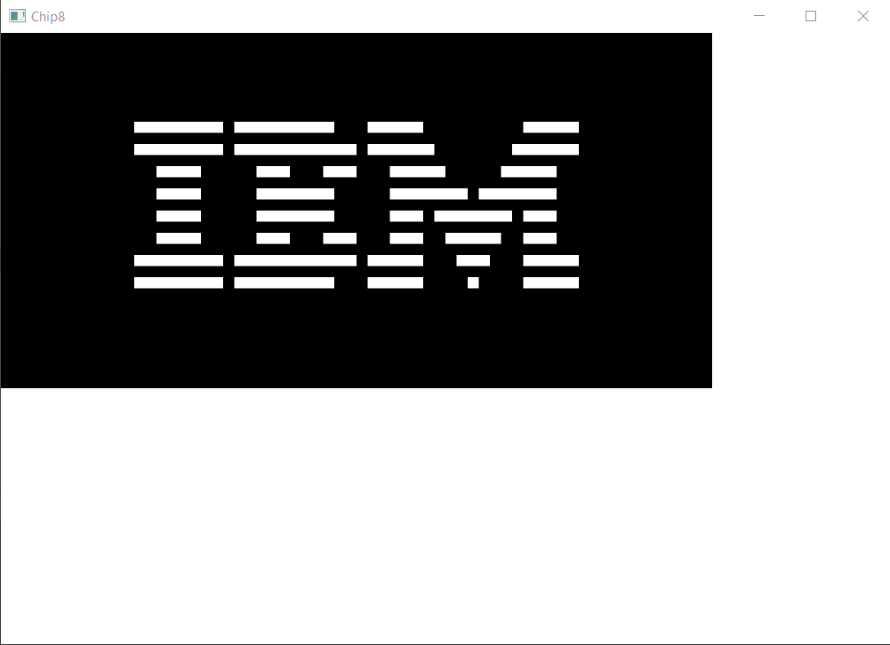

# chip8

Emulateur CHIP-8 en Kotlin

TODO :
- implémenter toutes les instructions CPU
- faire des tests pour les instructions
- appel de step() dans Chip8 à la bonne cadence (exécuté un certain nombre de fois sans pause pour le moment)
- GUI pour choisir le fichier .chip8 à charger en mémoire
- Options pour changer la taille de la fenêtre

Exemple de la ROM IBM Logo :

